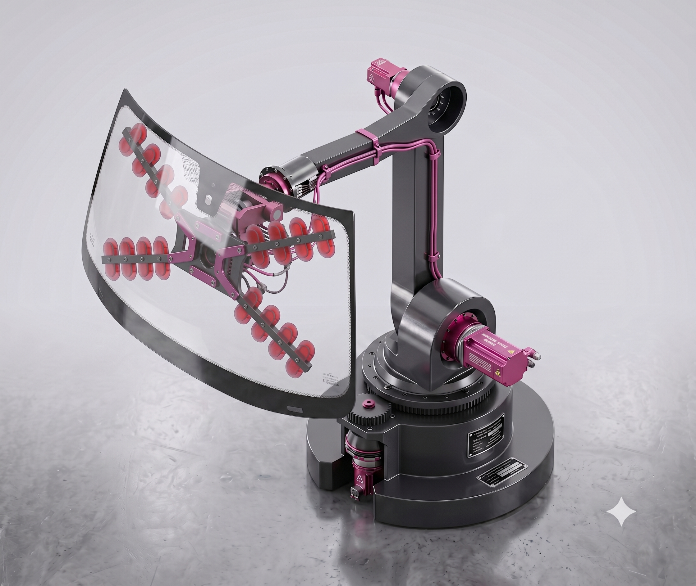
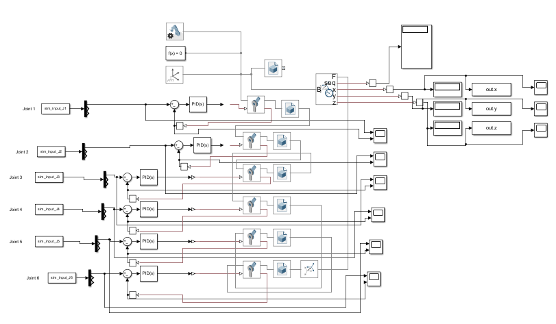
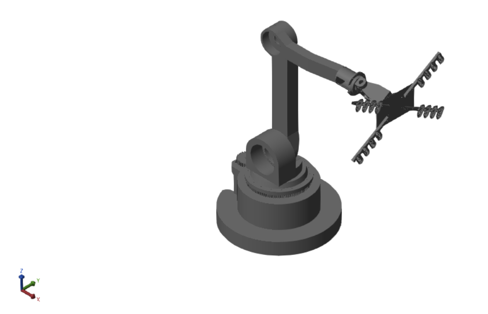
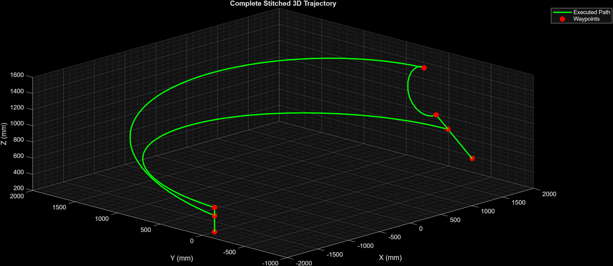
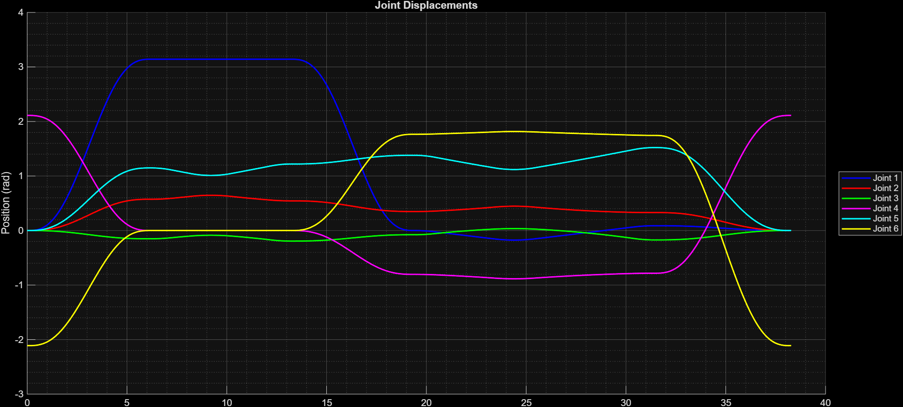
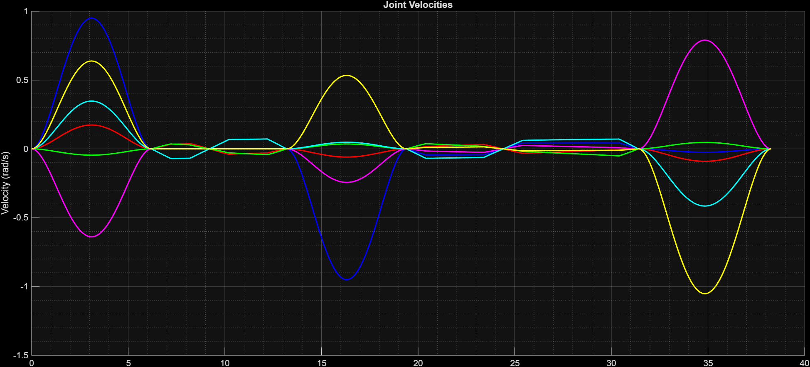
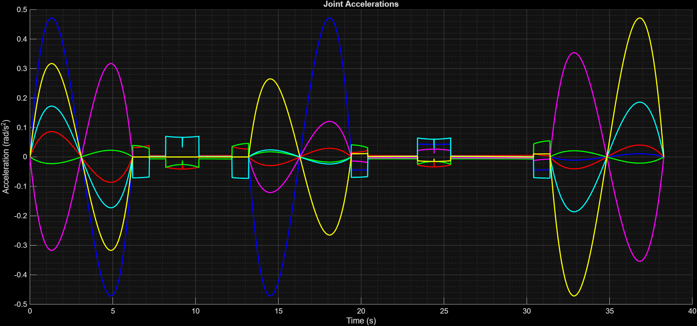
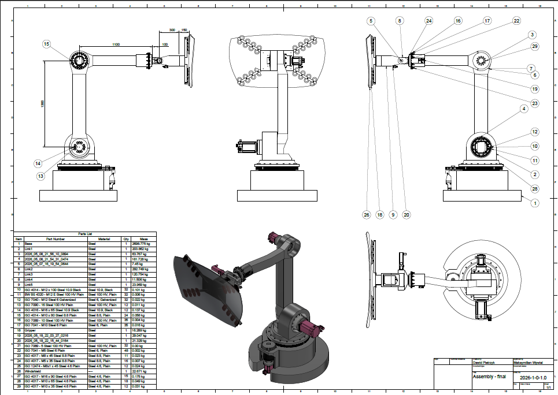

# Robot for Car Windshield Assembly

**Authors:** Eryk Pawełek, Dawid Pietrzyk, Nikodem Weltrowski, Maksymilian Wywiał

## Project Overview

This project details the design, kinematic and dynamic analysis, and control simulation of a 6-Degree of Freedom (DoF) articulated mechatronic manipulator dedicated to the automated assembly of automotive windshields integrated and simulatied fully in MATLAB/Simulink environment using Simscape addition. The system is engineered to handle variable payload capacities (up to approximately 20 kg for the glass alone, plus the mass of a multi-pad vacuum gripping system) while maintaining the high spatial precision required for continuous urethane adhesive application and frame insertion.

A fully articulated structure utilizing 6 rotational joints driven by AC servomotors was selected to maximize maneuverability and minimize the spatial footprint, allowing the end-effector to reach complex car body angles without collision.

## Design Assumptions & Motion Parameters

To ensure safe handling of fragile laminated glass and high positioning accuracy, the motion parameters were bounded below the absolute maximum capabilities of standard industrial robots. The operation is divided into two distinct phases:

- **Transfer Phase:** Fast transit from the picking station to the vehicle workspace. Maximum Tool Center Point (TCP) velocity is set to $1.0~m/s$ with an acceleration of $2.0~m/s^{2}$.
- **Mounting Phase:** Precision alignment and insertion. Maximum TCP velocity is reduced to $0.25m/s$ with an acceleration of $0.5m/s^{2}$

## Kinematic Analysis

### Denavit-Hartenberg Parameters

The spatial geometry of the manipulator is defined using the standard Denavit-Hartenberg (DH) convention.

| $i$ |       $\theta_{i}$​        | $d_{i}$ | $a_{i}$ |   $\alpha_{i}$   |      $Range of Motion$       |
| :-: | :------------------------: | :-----: | :-----: | :--------------: | :--------------------------: |
|  1  |        $\theta_{1}$        | $d_{1}$ |   $0$   | $-\frac{\pi}{2}$ |       $\pm180^{\circ}$       |
|  2  | $\theta_{2}-\frac{\pi}{2}$ |   $0$   | $a_{2}$ |       $0$        |       $\pm60^{\circ}$        |
|  3  |        $\theta_{3}$        |   $0$   |   $0$   | $-\frac{\pi}{2}$ | $+60^{\circ} / -240^{\circ}$ |
|  4  |        $\theta_{4}$        | $d_{4}$ |   $0$   | $\frac{\pi}{2}$  |       $\pm180^{\circ}$       |
|  5  |        $\theta_{5}$        |   $0$   |   $0$   | $-\frac{\pi}{2}$ |       $\pm90^{\circ}$        |
|  6  |        $\theta_{6}$        | $d_{6}$ |   $0$   |       $0$        |       $\pm180^{\circ}$       |

> (Note: $d_{1}=200mm$, $a_{2}=1300mm$, $d_{4}=1200mm$, $d_{6}=400mm$)

## Inverse kinematics

The inverse kinematics problem was solved analytically using the kinematic decoupling method, which is applicable because the three consecutive wrist axes (J4, J5, J6) intersect at a single mathematical point.

The position of the wrist center $\overline{P_{a}}$ is isolated from the Tool Center Point (TCP) $\overline{P}$ and the end-effector translation $\overline{P_{w}}$:

## $$\overline{P_{a}} = \overline{P} - \overline{P_{w}}$$

Solving for the base and arm joints ($\theta_{1}$, $\theta_{2}$, $\theta_{3}$), the base rotation is derived as:

### Joint 1 ($\theta_1$):

**$\theta_{1}=atan2(-P_{ay},-P_{ax})$**

or

**$\theta_{1}=atan2(P_{ay},P_{ax})$**

### Joint 3 ($\theta_3$):

First, the intermediate variable $D$ is calculated:

**$D=\frac{a_{2}^{2}+d_{4}^{2}-(P_{ax}^{2}+P_{ay}^{2})-(P_{az}-d_{1})^{2}}{2\cdot a_{2}\cdot d_{4}}$**

Then, $\theta_3$ is extracted using the $atan2$ function:

**$\theta_{3}=atan2(D,\pm\sqrt{1-D^{2}})$**

### Joint 2 ($\theta_2$):

Using the calculated $\theta_3$, constants $M$ and $N$ are defined:

**$M=a_{2}-d_{4}\cdot sin(\theta_{3})$**

**$N=d_{4}\cdot cos(\theta_{3})$**

The solution for $\theta_2$ is:

**$\theta_{2}=atan2(M\cdot R-N\cdot(P_{ax}-d_{1}),N\cdot R+M\cdot(P_{ax}-d_{1}))$**

### Joint 5 ($\theta_5$):

**$\theta_{5}=atan2(\pm\sqrt{R_{13}^{2}+R_{23}^{2}},R_{33})$**

### Joint 4 ($\theta_4$):

The solution depends on the variant of the $sin(\theta_5)$ solution.

For $sin(\theta_5)>0$:

**$\theta_{4}=atan2(-R_{23},-R_{13})$**

For $sin(\theta_5)<0$:

$\theta_{4}=atan2(R_{23},R_{13})$

### Joint 6 ($\theta_6$):

The solution follows the logic for the chosen root of $\theta_5$.

For the positive root of $\theta_5$:

$\theta_{6}=atan2(-R_{32},R_{31})$

For the negative root of $\theta_5$:

$\theta_{6}=atan2(R_{32},-R_{31})$

## Singularity Analysis

Four primary kinematic singularities were identified and mapped within the workspace:

1. **Shoulder Singularity:** Occurs when the wrist center lies exactly on the vertical $z_{0}$ axis ($P_{ax}=0, P_{ay}=0$), resulting in infinite solutions for $\theta_{1}$.

2. **Workspace Boundary:** Occurs when the target exceeds the maximum reach, yielding imaginary roots for $\theta_{3}$.

3. **Elbow Singularity:** Arises when the arm is fully extended or folded ($\theta_{3} = \pm90^{\circ}$), demanding infinite joint velocity for radial extension.

4. **Wrist Singularity:** Occurs when joint 5 is at $0^{\circ}$ or $\pm180^{\circ}$, causing axes 4 and 6 to become coaxial, making their individual angles indeterminate.

## Dynamic Analysis

A dynamic model was developed to calculate the joint torques required for trajectory execution. While the Euler-Lagrange method was initially explored, the analytical derivatives for the rotational kinetic energy of the distal links proved computationally expensive.

The equations of motion are expressed in standard matrix form:

$$\tau = M\dot{q} + C + G$$

> Where $M$ is the inertia matrix, $C$ represents the Coriolis and centrifugal forces, $G$ is the gravity vector, and $\dot{q}$ contains the joint accelerations.

## Simulation & Control (Simscape Multibody)

The CAD geometry, including proper mass and inertia tensors (calculated for steel, $\rho = 7850~kg/m^{3}$), was integrated into MATLAB/Simulink using the Simscape Multibody module.

## Trajectory Generation

A 5th-order polynomial interpolation was applied for joint space trajectories to ensure smooth, continuous velocity and acceleration profiles, while trapezoidal generation was utilized for linear motion segments.

## PID Control and Error Evaluation

Independent PID controllers were tuned for each joint using a decoupled approach, targeting a settling time of $<0.5s$ and overshoot of $<10\%$.

Tracking evaluation revealed high precision in the joint space (maximum deviations of $\pm0.035rad$ on Joint 1). However, error amplification through the extended kinematic chain (up to $1300mm$ link lengths) resulted in measurable Cartesian deviations at the end-effector.

- X-axis error: Peaked at $\pm44~mm$ during high-speed sweeps.
- Y-axis error: Peaked at $89~mm$ during major joint-space transitions.
- Z-axis error: Oscillated between $5~mm$ and $30~mm$ during motion.

Analysis indicated that static residual errors at the proximal joints are heavily influenced by the sampling time ($0.001s$), which limits the aggressiveness of the derivative gain before inducing system instability (derivative kick).

## Assembly drawing

